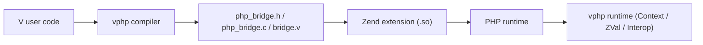

# vphp

`vphp` 是一个用 V 语言编写 PHP 扩展的绑定与编译框架。

它的目标不是重做一套 PHP 生态，而是让我们：

- 用 V 编写 PHP 扩展函数、类、接口、枚举和运行时逻辑
- 通过编译器自动生成 Zend glue code
- 在 V 侧直接调用 PHP 现有函数、类、对象、静态方法、属性和常量

一句话说：

> `vphp` = PHP 的 Zend Binding for V + 一套面向 PHP 扩展开发的编译器与运行时

## 当前状态

项目目前已经打通并持续有测试覆盖的能力包括：

- PHP 全局函数导出：`@[php_function]`
- PHP 类导出：`@[php_class]`
- PHP 方法导出：`@[php_method]`
- PHP 抽象类 / 抽象方法：`@[php_abstract]`
- PHP 接口：`@[php_interface]`
- V `implements` -> PHP `implements`
- PHP enum 风格导出：`@[php_enum]`
- class constant shadow：`@[php_const: ...]`
- class static property shadow：`@[php_static: ...]`
- `Context` 参数/返回值 API
- `ZVal` / `Val[T]` 转换
- `V -> PHP` interop：
  - `php_fn(name)`
  - `php_class(name)`
  - `ZVal.call(...)`
  - `ZVal.method(...)`
  - `ZVal.construct(...)`
  - `ZVal.prop(...)`
  - `ZVal.static_method(...)`
  - `ZVal.static_prop(...)`
  - `ZVal.@const(...)`

当前测试状态：

- `36 PASS`
- `1 SKIP`
- `0 FAIL`

## 项目结构

```text
vphpext/
  README.md
  vphp/                 # 运行时、Zend 绑定、编译器
    compiler/           # V -> PHP bridge 编译器
    zend/               # Zend 原生 API / bridge API 绑定
    context.v           # PHP -> V 调用上下文
    zval.v              # Zend zval 的 V 封装
    val.v               # V 语义值模型
    interop.v           # V -> PHP interop 入口
    object.v            # vphp 对象运行时辅助
  v_php_ext/            # 示例扩展、构建脚本与测试
    build.v
    functions.v
    article.v
    tests/
```

## 核心分层



更具体一点：

- `vphp/compiler/`
  - 负责编译 V 源码中的导出元信息
  - 生成 C bridge 和 V glue

- `vphp/zend/`
  - 负责 Zend 类型、常量、原生 API 与 `vphp_*` bridge API 的 FFI 绑定

- `vphp/` 根目录运行时
  - `Context`：PHP 调 V 时的调用上下文
  - `ZVal`：`C.zval` 的完整 wrapper
  - `Val[T]`：V 语义值模型
  - `interop`：V 调 PHP 的统一入口

## 最小示例

### 1. 声明扩展配置

在 [`v_php_ext/config.v`](/Users/guweigang/Source/vphpext/v_php_ext/config.v) 中：

```v
module main

import vphp

const ext_config = vphp.ExtensionConfig{
	name: 'vphptest'
	version: '0.1.0'
	description: 'PHP Bindings for V'
}
```

### 2. 导出一个 PHP 函数

```v
module main

@[php_function]
fn v_add(a i64, b i64) i64 {
	return a + b
}
```

PHP 侧就可以直接调用：

```php
echo v_add(1, 2);
```

### 3. 使用 `Context` 写更底层的导出函数

```v
module main

import vphp

@[php_function]
fn v_logic_main(ctx vphp.Context) {
	name := ctx.arg[string](0)
	ctx.return_string('Hello, ${name}')
}
```

### 4. 导出一个 PHP 类

```v
module main

@[heap]
@[php_class]
struct Article {
pub mut:
	title string
}

@[php_method]
pub fn (a &Article) construct(title string) {
	unsafe {
		mut self := a
		self.title = title
	}
}

@[php_method]
pub fn (a &Article) get_formatted_title() string {
	return '[Article] ${a.title}'
}
```

### 5. 在 V 侧调用 PHP 函数

```v
version := vphp.php_fn('phpversion').call([]).to_string()
```

或直接 typed：

```v
length := vphp.php_fn('strlen').call_v[int]([
	vphp.ZVal.new_string('codex'),
])!
```

### 6. 在 V 侧调用 PHP 类与对象

```v
obj := vphp.php_class('DateTime').construct([
	vphp.ZVal.new_string('now'),
])

formatted := obj.method('format', [
	vphp.ZVal.new_string('c'),
]).to_string()
```

## 构建

进入示例扩展目录：

```bash
cd /Users/guweigang/Source/vphpext/v_php_ext
make build
```

成功后会生成：

- `php_bridge.h`
- `php_bridge.c`
- `bridge.v`
- `vphp_ext_vphptest.c`
- `v_php_ext.so`

如果你已经提前跑过 `vphp` 编译器，并且仓库里已有生成的中间 C 文件，也可以直接跳过 compile 阶段，只做最终链接：

```bash
cd /Users/guweigang/Source/vphpext/v_php_ext
make ext
```

现在的构建入口是：

- `make build`
  - 完整流程：`vphp compile + 代码生成 + V 转 C + GCC 链接`
- `make ext`
  - 只使用仓库中现成的 `vphp_ext_*.c` / `php_bridge.c` / `php_bridge.h` 做最终链接
- `make test`
  - 先完整构建，再运行 `phpt`

## 测试

```bash
cd /Users/guweigang/Source/vphpext/v_php_ext
make test
```

当前测试覆盖了：

- 基础函数导出
- `Context` 参数解析
- map/list/struct 转换
- 类、继承、接口、抽象类
- class constant / static property shadow
- enum 导出
- closure / resource / globals / task
- `php_fn` / `php_class` / object/static/const interop
- typed interop 与 typed object restore

## 推荐阅读

### 如果你想理解编译器

从 [`vphp/compiler/README.md`](/Users/guweigang/Source/vphpext/vphp/compiler/README.md) 开始。

推荐顺序：

1. [`architecture.md`](/Users/guweigang/Source/vphpext/vphp/compiler/architecture.md)
2. [`repr.md`](/Users/guweigang/Source/vphpext/vphp/compiler/repr.md)
3. [`class_shadows.md`](/Users/guweigang/Source/vphpext/vphp/compiler/class_shadows.md)
4. [`builder.md`](/Users/guweigang/Source/vphpext/vphp/compiler/builder.md)
5. [`emission_pipeline.md`](/Users/guweigang/Source/vphpext/vphp/compiler/emission_pipeline.md)

### 如果你想理解运行时值模型

- [`val_conversions.md`](/Users/guweigang/Source/vphpext/vphp/val_conversions.md)

### 如果你想理解 OOP 导出能力

- [`oop_features.md`](/Users/guweigang/Source/vphpext/vphp/oop_features.md)

### 如果你想理解 V -> PHP interop

- [`interop.md`](/Users/guweigang/Source/vphpext/vphp/interop.md)

## 设计取向

这个项目当前有几个明确的设计原则：

1. `vphp` 保持通用
- 编译器、运行时、Zend 绑定、值模型都收敛在 `vphp/`

2. 示例与框架实验放在 `v_php_ext/`
- 避免把上层实验逻辑污染到底层 binding

3. 优先复用 PHP 生态，而不是在 V 里重造一切
- 这也是 `interop.v` 存在的原因

4. 编译器分层明确
- `repr`
- `parser`
- `linker`
- `builder`
- `export`
- `c_emitter`
- `v_glue`

## 目前已知边界

当前还有一些有意保守的地方：

- `@[php_enum]` 目前导出为 enum-style final class，不是 PHP 8.1 native enum object 语义
- `to_object[T]()` 只适用于 `vphp` 导出的对象，不适用于普通 PHP userland/internal 对象
- class static property 当前是 `shadow singleton + sync` 语义
- interop 层已经比较完整，但对象/类型系统还有继续细化空间

## 适合谁

如果你想做这些事情，`vphp` 会很适合：

- 用 V 给 PHP 写高性能扩展
- 给现有 PHP 项目暴露 V 计算能力
- 研究 Zend 扩展与 V 语言的桥接
- 构建一个有编译器、有运行时、有测试体系的 PHP Binding

---

如果你准备继续往下读，我推荐先从这三个文件开始：

1. [`v_php_ext/functions.v`](/Users/guweigang/Source/vphpext/v_php_ext/functions.v)
2. [`vphp/interop.md`](/Users/guweigang/Source/vphpext/vphp/interop.md)
3. [`vphp/compiler/README.md`](/Users/guweigang/Source/vphpext/vphp/compiler/README.md)
