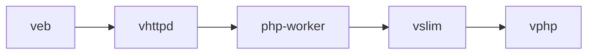
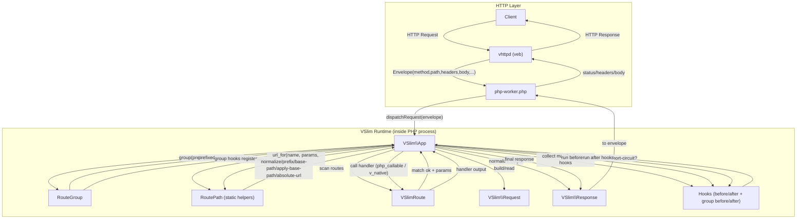

# vslim

`vslim` 是一个面向 PHP 开发者提供 Slim-inspired API。

它可以独立对接外部生态（ORM、中间件、PSR 接口等），不依赖 `vhttpd` 才能使用。

当前仓库同时提供 `vhttpd`，用于演示可选的 HTTP runtime 对接路径。

- `vphp` 提供 Zend binding、编译器和 runtime
- `vslim` 提供框架层 API（路由、request/response、hook、容器）
- `vhttpd` 提供独立的 HTTP runtime（可选集成）

一句话说：

> `vslim` 不是运行原版 Slim，而是做一个让 PHP 开发者心智熟悉的 V 微框架扩展。

## 三层边界

这条线现在有一个明确边界，我们后面也会继续守住：

- `vphp`
  - 只做 PHP <-> V bridge、编译器和 runtime
  - 不承载 HTTP 通用能力

- `vslim`
  - 只做 framework layer
  - 路由、middleware、request/response facade、reverse routing
  - 不把自己做成第二个 runtime

- `PHP 生态层`
  - ORM、中间件、PSR 接口、第三方包通过 Composer 接入
  - `vslim` 作为框架扩展与其协作，不绑定特定 HTTP runtime

## 可选联动结构（示例）



- `veb`
  - HTTP/runtime 源头
- `vhttpd`
  - 独立 runtime，可选作为 `vslim` 的前置入口
- `php-worker`
  - PHP userland 与 PSR-7 边界
- `vslim`
  - runtime framework layer
- `vphp`
  - bridge/compiler/runtime

## VSlim 工作流



## vhttpd 规范文档

- PSR-7/15 支持矩阵：[vhttpd/docs/psr_support.md](/Users/guweigang/Source/vphpext/vhttpd/docs/psr_support.md)
- 错误与超时语义：[vhttpd/docs/failure_model.md](/Users/guweigang/Source/vphpext/vhttpd/docs/failure_model.md)
- ORM 集成建议：[docs/orm.md](/Users/guweigang/Source/vphpext/vslim/docs/orm.md)

## 为什么不直接复用 veb 的 route 定义

这里我们刻意没有把 `vslim` 做成 `veb` 的语法薄封装，原因不是要绕开 `veb`，而是两层职责不同：

- `veb`
  - 更适合 V 原生应用
  - 路由和 middleware 主要是 compile-time 生成
  - `App` 结构和 handler 关系在 V 编译阶段就确定

- `vslim`
  - 需要让 PHP userland 在运行时 builder 路由
  - 例如：
    - `$app->get(...)`
    - `$app->group(...)`
    - `$app->middleware(...)`
  - 这些能力天然是 runtime registration，不是 compile-time route scanning

所以第一版的原则是：

- `veb` 负责 HTTP 输入、连接生命周期、请求原始数据
- `vslim` 负责运行时路由、middleware、response facade

换句话说：

> `vslim` 复用 `veb` 作为 HTTP 源头，而不是重复实现 server；
> 但它保留自己的 runtime router，因为 PHP-side app builder 本质上不是 `veb` 的 compile-time 模式。

## 当前目标

这版 `vslim` 已经把早期在 `v_php_ext/slim.v` 里验证过的 MVP 核心迁了过来，并保留独立扩展形态。

当前包括：

- `SlimApp` 路由核心（纯 V）
- middleware chain
- 路由参数匹配
- `VSlim\Request` 请求包装
- `VSlim\App` / `VSlim\Response` 作为 PHP-facing façade
- `vslim_handle_request()` / `vslim_demo_dispatch()` 作为稳定函数入口
- PSR-11 compatible container (`VSlim\\Container`, provided by `vslim.so`, requires `psr` extension)

## PSR-11 container

`VSlim` now provides a PSR-11 compatible container directly from `vslim.so`:

- `VSlim\\Container` implements `Psr\\Container\\ContainerInterface`
- `VSlim\\Container\\NotFoundException` implements `Psr\\Container\\NotFoundExceptionInterface`
- `VSlim\\Container\\ContainerException` implements `Psr\\Container\\ContainerExceptionInterface`

Runtime requirement:

- `psr` extension (for `Psr\\Container\\*` interfaces)

Minimal usage:

```php
<?php

use VSlim\Container;

$container = new Container();
$container->set('app.name', 'vslim');
$container->factory('clock', fn () => new DateTimeImmutable('now'));
echo $container->get('app.name');
```

## 可选与 vhttpd 的交互模型

如果你选择 `vhttpd` 作为 runtime，推荐交互边界是：

```text
Client -> vhttpd -> PHP worker -> vslim -> PHP worker -> vhttpd -> Client
```

分工：

- `vhttpd`
  - 以 `veb` 作为 HTTP 源头
  - 接收网络请求
  - 利用 `veb.Context` / `http.Request` 提取 method/path/query/body/header/cookie
  - 做连接管理、日志和可观测性

- PHP worker
  - 负责加载业务代码和 Composer 生态
  - 调用 `vslim_handle_request(...)` 或 `VSlim\App`

- `vslim`
  - 负责路由匹配、middleware、请求分发、响应封装
  - 输出稳定的 `{status, body, content_type, headers}` 结构

当前推荐的 worker 协议是一个 request envelope：

```php
[
    'method' => 'GET',
    'path' => '/users/42?trace_id=worker',
    'body' => '',
    'scheme' => 'https',
    'host' => 'example.test',
    'port' => '443',
    'protocol_version' => '1.1',
    'remote_addr' => '127.0.0.1',
    'headers' => ['x-request-id' => 'demo'],
    'cookies' => ['sid' => 'cookie-7'],
    'query' => ['trace_id' => 'worker'],
    'attributes' => [],
    'server' => ['host' => 'example.test'],
    'uploaded_files' => [],
]
```

`vhttpd` 或 PHP worker 可以把它直接交给：

```php
$response = vslim_handle_request($requestEnvelope);
```

如果你在 PHP worker 中想走更轻量的 map 返回，可用：

```php
$map = $app->dispatch_envelope_map($requestEnvelope);
// 最低保证字段：
// status, body, content_type
// 以及响应头：headers_<lowercase-name>（如 headers_x-request-id）
```

这里的关键原则是：

- request 采集尽量来自 `veb`
- worker envelope 只是 transport 边界
- `vslim` 只消费归一化后的 request 语义

## 为什么这样分层

这样做的价值在于：

1. 不强行兼容原版 Slim 内部实现
2. 可以保留 PHP 生态和 userland 开发体验
3. `vhttpd` 不需要嵌入 PHP 解释器
4. `vslim` 可以逐步长成一个真正的 framework extension

说明：

- 当前第一版先使用 plain PHP class 名，优先把独立扩展骨架跑通
- 后面如果需要更强的 namespaced class 体验，可以再专门收编译器对“namespaced return object”的支持

## 当前示例路由

- `GET /health`
- `GET /users/:id`
- `GET /private`
- `GET /panic`
- `GET /meta`

中间件：

- `with_trace_id`
- `auth_guard`

## 当前 PHP 面

```php
$app = VSlim\App::demo();
$res = $app->dispatch('GET', '/users/42');

echo $res->status;
echo $res->body;
```

也可以显式构建请求对象：

```php
$req = new VSlim\Request('GET', '/users/7?trace_id=from-php', '');
$req->set_scheme('https');
$req->set_host('demo.local');
$req->set_remote_addr('127.0.0.1');
$req->set_headers(['x-trace-id' => 'from-header']);
$req->set_cookies(['sid' => 'cookie-7']);
$req->set_attributes(['actor' => 'tester']);
$req->set_query(['trace_id' => 'from-json']);
$req->set_port('443');
$req->set_protocol_version('1.1');

echo $req->query('trace_id');
echo $req->header('x-trace-id');
echo $req->attribute('actor');
print_r($req->query_params());
print_r($req->headers());
print_r($req->cookies());
print_r($req->attributes());
print_r($req->server_params());
echo $req->content_type();
echo $req->server_value('server_name');
echo $req->uploaded_file_count();
var_dump($req->has_uploaded_files());
var_dump($req->is_secure());

$res = $app->dispatch_request($req);
echo $req->param('id');
echo $req->cookie('sid');
```

请求对象说明：

- 第一版推荐优先使用 `set_*()` 方法来调整 request metadata
- `VSlim\Request` 目前仍保留 public 字段，方便调试和过渡
- 但从 API 演进角度，我们会把 `set_scheme()/set_host()/set_port()/set_protocol_version()/set_remote_addr()` 视为稳定入口

响应对象也提供了基础 helper：

```php
$res = new VSlim\Response(200, 'hello', 'text/plain; charset=utf-8');
$res->set_header('x-demo', 'yes')
    ->set_status(202)
    ->json('{"ok":true}');

$res->html('<b>ok</b>');
echo $res->content_length();
echo $res->content_type;

$res->set_content_type('application/xml');

$res->set_cookie('sid', 'cookie-202');
$res->set_cookie_full('sid', 'cookie-303', '/', 'demo.local', 60, true, true, 'lax');
echo $res->cookie_header();

echo $res->header('x-demo');
print_r($res->headers());
echo $res->content_type;
```

也可以在 PHP 侧直接 builder 路由、group 和 middleware：

```php
$app = new VSlim\App();

$app->before(function (VSlim\Request $req) {
    if ($req->path === '/blocked') {
        return new VSlim\Response(403, 'blocked', 'text/plain; charset=utf-8');
    }
    return null;
});

$app->after(function (VSlim\Request $req, VSlim\Response $res) {
    $res->set_header('x-runtime', 'vslim');
    return $res;
});

$api = $app->group('/api');
$api->get_named('api.users.show', '/users/:id', function (VSlim\Request $req) {
    return 'user:' . $req->param('id');
});
$api->put_named('api.users.update', '/users/:id', function (VSlim\Request $req) {
    return 'updated:' . $req->param('id');
});
$api->any('/echo/:id', function (VSlim\Request $req) {
    return $req->method . ':' . $req->param('id');
});

$app->set_base_path('/v1');

echo $app->url_for('api.users.show', ['id' => '42']);
// /v1/api/users/42

echo $app->url_for_query('api.users.show', ['id' => '42'], ['tab' => 'profile']);
// /v1/api/users/42?tab=profile

echo $app->url_for_abs('api.users.show', ['id' => '42'], 'https', 'demo.local');
// https://demo.local/v1/api/users/42

$redirect = $app->redirect_to('api.users.show', ['id' => '42']);
echo $redirect->status;
echo $redirect->header('location');
```

说明：

- `before()` 用于请求进入 route handler 之前的短路逻辑
- `after()` 用于基于 `VSlim\Response` 做统一收口
- `middleware()` 是独立链路，签名为 `function (VSlim\Request $req, callable $next)`
- group 也支持 `before()` / `after()` / `middleware()`

生命周期返回约定：

- `before()` 返回 `null`：继续执行后续 hook / route handler
- `before()` 返回 `VSlim\Response` / `array` / `string`：立即 short-circuit，并继续进入 `after()`
- `middleware()` 必须返回 `VSlim\Response` / `array` / `string`（可直接 `return $next($req)`）
- `middleware()` 返回 `VSlim\Response` / `array` / `string`：立即 short-circuit，并继续进入 `after()`
- `after()` 返回 `null`：保留当前响应
- `after()` 返回 `VSlim\Response` / `array` / `string`：替换当前响应
- `before()/middleware()/route/after()` 中直接抛出的 PHP 异常：原样向外冒泡
- hook 或 route 返回无法归一化的值：收敛成 `500 Invalid route response`

执行顺序：

```text
app before -> matching group before -> app middleware -> matching group middleware -> route/not-found -> app after -> matching group after
```

这个顺序已经由测试固定：

- [/Users/guweigang/Source/vphpext/vslim/tests/test_php_hook_order.phpt](/Users/guweigang/Source/vphpext/vslim/tests/test_php_hook_order.phpt)

也可以直接用函数入口：

```php
$r = vslim_demo_dispatch('GET', '/private?token=ok');
```

或者用更适合 `vhttpd` 的 envelope 入口：

```php
$r = vslim_handle_request([
    'method' => 'GET',
    'path' => '/private?token=ok',
    'body' => '',
]);
```

## 构建与测试

```bash
cd /Users/guweigang/Source/vphpext/vslim
make build
make ext
make vhttpd
make serve
make test
make mvp-check
```

HTTP runtime 相关文件现在在：

- [/Users/guweigang/Source/vphpext/vslim/docs/psr7_bridge.md](/Users/guweigang/Source/vphpext/vslim/docs/psr7_bridge.md)
- [/Users/guweigang/Source/vphpext/vhttpd/src/main.v](/Users/guweigang/Source/vphpext/vhttpd/src/main.v)
- [/Users/guweigang/Source/vphpext/vhttpd/php/php-worker.php](/Users/guweigang/Source/vphpext/vhttpd/php/php-worker.php)
- [/Users/guweigang/Source/vphpext/vhttpd/README.md](/Users/guweigang/Source/vphpext/vhttpd/README.md)

开发时最顺手的入口是：

- `make vhttpd`：重新编译 `vhttpd`
- `make serve`：用 managed worker 模式直接拉起 `vhttpd + php-worker + vslim`

## Minimal End-to-End Tutorial

1. 构建扩展和 `vhttpd`

```bash
cd /Users/guweigang/Source/vphpext/vslim
make build
make vhttpd
```

2. 编写一个最小 worker app，例如：
   [/Users/guweigang/Source/vphpext/vhttpd/examples/hello-app.php](/Users/guweigang/Source/vphpext/vhttpd/examples/hello-app.php)

把它拷到：

- [/Users/guweigang/Source/vphpext/vhttpd/php/app.php](/Users/guweigang/Source/vphpext/vhttpd/php/app.php)

或者通过环境变量指定：

```bash
export VSLIM_HTTPD_APP=/Users/guweigang/Source/vphpext/vhttpd/examples/hello-app.php
```

3. 启动服务

```bash
cd /Users/guweigang/Source/vphpext/vslim
make serve
```

4. 发请求

```bash
curl "http://127.0.0.1:19881/dispatch?method=GET&path=/hello/codex"
curl -i "http://127.0.0.1:19881/dispatch?method=GET&path=/blocked"
curl "http://127.0.0.1:19881/dispatch?method=GET&path=/api/meta"
curl -i "http://127.0.0.1:19881/dispatch?method=GET&path=/go/nova"
```

这条链路是：

```text
HTTP -> vhttpd(veb) -> php-worker -> VSlim\App -> VSlim\Response
```

这个示例现在也覆盖了：

- named route：`hello.show`
- reverse routing：`url_for(...)`
- redirect helper：`redirect_to(...)`

## First Release Boundary

## Public API Snapshot

第一版建议优先围绕这几个对象使用：

### `VSlim\App`

- route handler accepts:
  - callable
  - container service id (`string`, resolved via `VSlim\Container`)
  - class name string (`string`, auto-instantiated with no-arg constructor when service missing)
  - `[service_id]` array (service callable / `__invoke`)
  - `[service_id, method]` array (resolved via `VSlim\Container`)
- app builder：
  - `get/post/put/patch/delete/head/options/any`
  - `map(...)`
  - `resource(path, ControllerClass::class)` (index/show/store/update/destroy/create/edit)
  - `api_resource(path, ControllerClass::class)` (index/show/store/update/destroy)
  - `resource_opts(path, ControllerClass::class, options)`
  - `api_resource_opts(path, ControllerClass::class, options)`
  - `get_named/post_named/put_named/patch_named/delete_named/head_named/options_named/any_named`
  - `map_named(...)`
  - `group(...)`
- lifecycle：
  - `before(...)`
  - `after(...)`
  - `middleware(...)` (独立 middleware 链，支持 `$next`)
  - `set_not_found_handler(...)` / `not_found(...)`
  - `set_error_handler(...)` / `error(...)`
  - `set_error_response_json(...)` / `error_response_json_enabled()`
- container：
  - `has_container()`
  - `container()` (lazy create `VSlim\Container`)
  - `set_container(VSlim\Container $container)`
- dispatch：
  - `dispatch(...)`
  - `dispatch_body(...)`
  - `dispatch_request(...)`
  - `dispatch_envelope(...)`
  - `dispatch_envelope_map(...)` (`map<string,string>`)
- reverse routing：
  - `url_for(...)`
  - `url_for_query(...)`
  - `url_for_abs(...)`
  - `url_for_query_abs(...)`
  - `redirect_to(...)`
  - `redirect_to_query(...)`
- route metadata：
  - `route_count()`
  - `route_names()`
  - `has_route_name(...)`
  - `allowed_methods_for(...)`
  - `route_manifest()` (`[]map<string,string>`)
  - `route_conflicts()` (`[]map<string,string>`)
  - `route_manifest_lines()` (例如：`GET /users/:id #users.show`)
  - `route_conflict_keys()` (例如：`GET /health x2`)

### `VSlim\Request`

- transport facade：
  - `query(...)`
  - `query_params()`
  - `input(...)`
  - `input_or(...)`
  - `all_inputs()`
  - `header(...)`
  - `headers()`
  - `request_id()`
  - `trace_id()`
  - `cookie(...)`
  - `cookies()`
  - `attribute(...)`
  - `attributes()`
  - `server_value(...)`
  - `server_params()`
- routing facade：
  - `param(...)`
  - `route_params()`
- environment：
  - `content_type()`
  - `body_format()` (`json|form|multipart|none`)
  - `is_json_body()`
  - `is_form_body()`
  - `is_multipart_body()`
  - `parsed_body()`
  - `json_body()`
  - `form_body()`
  - `multipart_body()`
  - `uploaded_files()`
  - `uploaded_file_count()`
  - `is_secure()`

请求体校验（dispatch 阶段）：

- JSON body 语法错误会返回 `400 Bad Request`
- 可通过环境变量 `VSLIM_MAX_BODY_BYTES` 限制请求体大小（字节）
  - `0` 或未设置：不限制
  - 超限返回 `413 Payload Too Large`
- setters：
  - `set_method(...)`
  - `set_target(...)`
  - `set_body(...)`
  - `set_scheme(...)`
  - `set_host(...)`
  - `set_port(...)`
  - `set_protocol_version(...)`
  - `set_remote_addr(...)`
  - `set_query(...)`
  - `set_headers(...)`
  - `set_cookies(...)`
  - `set_attributes(...)`
  - `set_server(...)`
  - `set_uploaded_files(...)`

兼容说明：

- `query_all()/headers_all()/cookies_all()/params_all()/attributes_all()/server_all()/uploaded_files_all()` 仍然保留
- 但第一版推荐主用：
  - `query_params()`
  - `headers()`
  - `cookies()`
  - `route_params()`
  - `attributes()`
  - `server_params()`
  - `uploaded_files()`

### `VSlim\Response`

- headers：
  - `set_status(...)`
  - `set_header(...)`
  - `with_request_id(...)`
  - `with_trace_id(...)`
  - `header(...)`
  - `has_header(...)`
  - `set_content_type(...)`
- body helpers：
  - `text(...)`
  - `json(...)`
  - `html(...)`
- redirect：
  - `redirect(...)`
  - `redirect_with_status(...)`
- cookies：
  - `set_cookie(...)`
  - `set_cookie_opts(...)`
  - `set_cookie_full(...)`
  - `delete_cookie(...)`

兼容说明：

- `with_status(...)` 仍然保留
- 但第一版推荐主用 `set_status(...)`
- 因为 `VSlim\Response` 是可变对象，不是 PSR-7 immutable response

### `VSlim\View` / `VSlim\Controller` (MVP)

`VSlim` 现在提供最小 MVC 视图层能力：

- `VSlim\View`
  - `__construct(base_path, assets_prefix)`
  - `set_base_path(...)`
  - `set_assets_prefix(...)`
  - `asset('app.js') -> /assets/app.js`
  - `render(template, data)`（`{{ key }}` 占位符）
  - `render_with_layout(template, layout, data)`（`{{slot:content}}` 布局槽位）
  - `render_response(template, data)`（返回 `VSlim\Response`，`text/html; charset=utf-8`）
  - `render_response_with_layout(template, layout, data)`
- `VSlim\Controller`
  - `__construct(VSlim\App $app)`
  - `render(template, data)`
  - `render_with_layout(template, layout, data)`
  - `url_for(name, params)`
  - `url_for_query(name, params, query)`
  - `text(body, status)`
  - `json(body, status)`
  - `redirect(location, status)`
  - `redirect_to(name, params, status)`
  - `redirect_to_query(name, params, query, status)`
- `VSlim\App`
  - `set_view_base_path(...)`
  - `set_assets_prefix(...)`
  - `make_view()`
  - `view(template, data)`
  - `view_with_layout(template, layout, data)`

模板中的资源占位符可写成：

```html
<script src="{{asset:app.js}}"></script>
```

局部模板与布局：

```html
<!-- layout.html -->
<body>
  {{include:partials/header.html}}
  <main>{{slot:content}}</main>
</body>
```

这和 `vhttpd` 的 `veb.assets` 数据面静态资源前缀约定一致（默认 `/assets`）。

控制器内也可以直接基于命名路由跳转：

```php
final class UserController extends VSlim\Controller {
    public function jump(string $id): VSlim\Response {
        return $this->redirect_to('users.show', ['id' => $id], 302);
    }
}
```

### Resource Routing 快捷示例

基础资源路由：

```php
$app->resource('/users', UserController::class);
$app->api_resource('/api/users', UserController::class);
$app->singleton('/profile', ProfileController::class);
$app->api_singleton('/api/profile', ProfileController::class);
```

带选项（`only/except/names`）：

```php
$app->resource_opts('/books', BookController::class, [
    'only' => ['index', 'show'],
    'name_prefix' => 'library.books',
    'param' => 'book_id',
    'missing' => function (VSlim\Request $req, string $action, array $params) {
        return new VSlim\Response(404, 'missing:' . $action, 'text/plain; charset=utf-8');
    },
]);

$app->api_resource_opts('/api/books', BookController::class, [
    'except' => 'destroy',
    'name_show' => 'api.books.fetch',
    // 也支持 names 映射：
    // 'names' => ['show' => 'api.books.fetch']
]);
$app->singleton_opts('/profile', ProfileController::class, [
    'only' => ['show', 'update'],
    'name_prefix' => 'profile',
]);
```

在 group 中使用：

```php
$api = $app->group('/v1');
$api->api_resource('/orders', OrderController::class);
$api->resource_opts('/products', ProductController::class, [
    'except' => ['create', 'edit'],
    'name_prefix' => 'v1.products',
]);

// nested + shallow member routes:
$app->resource_opts('/photos/:photo_id/comments', CommentController::class, [
    'only' => ['index', 'show'],
    'param' => 'comment_id',
    'shallow' => true, // show/update/destroy -> /comments/:comment_id
]);
```

说明：

- `resource(...)`：`index/create/store/show/edit/update/destroy`
- `api_resource(...)`：`index/store/show/update/destroy`
- `singleton(...)`：`show/create/store/edit/update/destroy`
- `api_singleton(...)`：`show/store/update/destroy`
- `update` 同时注册 `PUT` 和 `PATCH`
- 若 controller 未实现某个 action，对应 action 路由不会注册（不会触发 `500`；通常表现为 `404/405`，取决于是否被其它已注册路由命中）

第一版我们明确承诺这些：

- `veb` 是 HTTP/runtime 源头
- `vhttpd` 尽量薄，贴着 `veb`
- `vslim` 只做 framework layer
- `vphp` 只做 bridge/compiler/runtime
- request transport 统一使用结构化数组 envelope
- PHP userland 通过 `VSlim\App` runtime builder 注册 routes / groups / hooks
- `dispatch_envelope_map(...)` 在 map 协议下返回：
  - `status` / `body` / `content_type`
  - `headers_<lowercase-name>`（例如 `headers_x-request-id` / `headers_x-trace-id`）

第一版明确不做这些：

- 不直接兼容原版 Slim 内核
- 不把 `vslim` 改造成完整 PSR-7 immutable core
- 不让 `vphp` 承担 HTTP helper

更细的范围说明见：

- [/Users/guweigang/Source/vphpext/vslim/docs/release_v1.md](/Users/guweigang/Source/vphpext/vslim/docs/release_v1.md)
- [/Users/guweigang/Source/vphpext/vslim/docs/protocol.md](/Users/guweigang/Source/vphpext/vslim/docs/protocol.md)
